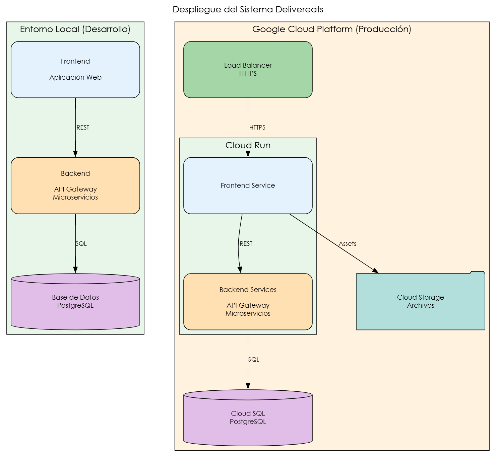

# DOCUMENTACIÓN / Práctica 1
# SISTEMA - Delivereats

## LABORATORIO SOFTWARE AVANZADO
---
| Nombre    | Carnet |
|-----------|------|
| Susan Pamela Herrera Monzón  |  201612218 |
---
# Requerimientos Funcionales - Delivereats
---
Los requerimientos funcionales describen las funcionalidades específicas que debe realizar el sistema Delivereats a cada tipo de usuario. Están organizados por roles.

---
# ROL: CLIENTE

* RF-CLI-001: Registro de Usuario Cliente
El sistema debe permitir que un nuevo usuario se registre como cliente.

---

* RF-CLI-002: Inicio de Sesión
El cliente debe poder autenticarse en el sistema.

---

* RF-CLI-003: Explorar Restaurantes
El cliente debe poder ver listado de restaurantes disponibles.

---

* RF-CLI-004: Ver Menú de Restaurante
El cliente debe poder consultar el menú completo de un restaurante específico.

---

* RF-CLI-005: Crear Orden
El cliente debe poder crear una orden con items del menú.

---

* RF-CLI-006: Cancelar Orden
El cliente debe poder cancelar su orden antes de que esté EN_PROCESO.

---

* RF-CLI-007: Ver Historial de Órdenes
El cliente debe poder consultar sus órdenes anteriores.

# ROL: RESTAURANTE/VENDEDOR

* RF-RES-001: Registro de Restaurante
Un usuario debe poder registrarse como propietario de restaurante.

---

* RF-RES-002: Crear Ítem de Menú
El restaurante debe poder agregar nuevos platillos a su menú.

---

* RF-RES-003: Actualizar Ítem de Menú
El restaurante debe poder modificar información de sus platillos.

---

* RF-RES-004: Eliminar Ítem de Menú
El restaurante debe poder eliminar platillos de su menú.

---

* RF-RES-005: Ver Órdenes Recibidas
El restaurante debe poder ver todas las órdenes en estado CREADA.

---

* RF-RES-006: Aceptar y Procesar Orden
El restaurante debe poder aceptar una orden y comenzar su preparación.

---

* RF-RES-007: Marcar Orden como Lista
El restaurante debe poder marcar una orden como LISTA para entrega.
---

* RF-RES-008: Rechazar Orden
El restaurante debe poder rechazar una orden con motivo.

---

# ROL: REPARTIDOR

* RF-REP-001: Registro de Repartidor
Un usuario debe poder registrarse como repartidor.

---

* RF-REP-002: Ver Órdenes Disponibles
El repartidor debe poder ver órdenes en estado LISTA.

---

* RF-REP-003: Aceptar Orden para Entrega

---

* RF-REP-004: Actualizar Estado a En Camino
El repartidor marca que está en ruta.

---

* RF-REP-005: Marcar Entrega como Completada
El repartidor confirma que completó la entrega.

---

* RF-REP-006: Cancelar Entrega
El repartidor puede cancelar una entrega con motivo.

---

# ROL: ADMINISTRADOR

* RF-ADM-001: Crear Restaurante
El administrador puede crear nuevos restaurantes en el sistema.

---

* RF-ADM-002: Actualizar Restaurante
El administrador puede modificar información de restaurantes.

---

* RF-ADM-003: Eliminar Restaurante
 El administrador puede desactivar restaurantes.

---

* RF-ADM-004: Ver Reportes del Sistema
El administrador puede consultar estadísticas generales.

---
# Requerimientos NO Funcionales - Delivereats
----

* RNF-001: Rendimiento
El sistema debe responder de manera eficiente a las solicitudes.

---

* RNF-002: Escalabilidad
**Descripción:** El sistema debe poder escalar horizontalmente.

---

* RNF-003: Disponibilidad
El sistema debe estar disponible 24/7.

---

* RNF-004: Seguridad
El sistema debe proteger la información de los usuarios.

---

* RNF-005: Usabilidad
El sistema debe ser intuitivo y fácil de usar.

---

* RNF-006: Mantenibilidad
El código debe ser fácil de mantener y actualizar.
---

* RNF-007: Portabilidad
El sistema debe funcionar en diferentes plataformas.
---

* RNF-008: Interoperabilidad
El sistema debe poder integrarse con servicios externos.

---

* RNF-009: Confiabilidad
El sistema debe manejar errores adecuadamente.

---

* RNF-010: Cumplimiento Legal
El sistema debe cumplir con regulaciones aplicables.

----
# DIAGRAMA ALTO NIVEL 
----
## Arquitectura del Sistema

El sistema implementa una **arquitectura basada en microservicios**, organizada en capas, cuyo objetivo es garantizar **escalabilidad, mantenibilidad y separación de responsabilidades**. A continuación, se describe el funcionamiento general del diagrama de arquitectura de alto nivel.

### Capa Frontend
La capa de frontend corresponde a la aplicación web desarrollada con tecnologías modernas como React, Vue o Angular. Esta capa es responsable de la interacción con los usuarios y proporciona interfaces diferenciadas para los roles de cliente, restaurante, repartidor y administrador.  
El frontend no accede directamente a los microservicios, sino que se comunica exclusivamente con el API Gateway mediante peticiones HTTP/REST en formato JSON.

### Capa API Gateway
El API Gateway actúa como el **punto único de entrada** al sistema. Su función principal es recibir las solicitudes del frontend y redirigirlas al microservicio correspondiente. Además, centraliza aspectos de seguridad como la validación de tokens JWT, el control de acceso y el manejo de reglas básicas de seguridad.  
Esta capa permite desacoplar el frontend de la lógica interna del sistema.

### Capa de Microservicios
La lógica de negocio se encuentra distribuida en microservicios independientes, cada uno con una responsabilidad específica:

- **Auth Service:** gestiona el registro, inicio de sesión y validación de tokens JWT.
- **Catalog Service:** administra la información de restaurantes y menús.
- **Order Service:** controla la creación, consulta y actualización de órdenes.
- **Delivery Service:** gestiona la asignación y el estado de las entregas.
- **Notification Service:** se encarga del envío de notificaciones y correos electrónicos.

La comunicación entre el API Gateway y los microservicios, así como entre algunos servicios internos, se realiza de forma directa.

### Capa de Base de Datos
El sistema utiliza una base de datos relacional PostgreSQL para el almacenamiento de la información. Cada microservicio accede únicamente a los datos que necesita, lo que favorece la organización, integridad y consistencia de la información.

### Servicios Externos
El servicio de notificaciones se integra con un servidor SMTP externo para el envío de correos electrónicos. Esta integración se mantiene aislada del resto del sistema, evitando dependencias directas entre los microservicios y servicios externos.

### Beneficios de la Arquitectura
Esta arquitectura permite escalar los servicios de manera independiente, facilita el mantenimiento del sistema y mejora la seguridad al centralizar el acceso mediante el API Gateway. Además, su diseño modular la hace adecuada para sistemas modernos de alta disponibilidad y crecimiento progresivo.

---

----
# DIAGRAMA DESPLIEGUE 
----

El diagrama de despliegue es una vista mas simple de cómo se ejecuta el sistema Delivereats tanto en el entorno de desarrollo como en la nube, permitiendo identificar claramente los componentes principales y su relación.

### Desarrollo
En el entorno local se representa la ejecución del sistema durante la etapa de desarrollo. El Frontend corresponde a la aplicación web utilizada por los usuarios para interactuar con el sistema. Esta aplicación se comunica mediante peticiones **REST** con el **Backend**, el cual agrupa el API Gateway y los microservicios que contienen la lógica de negocio del sistema.

El backend se conecta a una **base de datos PostgreSQL**, donde se almacena la información necesaria para el funcionamiento del sistema. Esta separación permite desarrollar y probar la aplicación de forma controlada antes de su despliegue.

### Google Cloud Platform
En el entorno de producción, el sistema se encuentra desplegado en **Google Cloud Platform (GCP)**. El acceso de los usuarios se realiza a través de un **Load Balancer**, el cual gestiona las conexiones seguras mediante **HTTPS** y distribuye el tráfico hacia los servicios disponibles.

El **Frontend Service** se ejecuta en **Cloud Run**, permitiendo que la aplicación web escale automáticamente según la demanda. Este frontend se comunica con los **Backend Services**, que incluyen el API Gateway y los microservicios desplegados también en Cloud Run, encargados de procesar las solicitudes del sistema.

Los servicios de backend se conectan a **Cloud SQL con PostgreSQL**, una base de datos administrada que garantiza la persistencia, disponibilidad y seguridad de los datos. Adicionalmente, el frontend accede a **Cloud Storage** para la carga y consulta de archivos estáticos, como imágenes o recursos de la aplicación.

### Flujo General del Sistema
El flujo de funcionamiento del sistema inicia cuando el usuario accede a la aplicación web. Las solicitudes son enviadas al backend a través del API Gateway, donde se procesan y se obtiene o almacena la información necesaria en la base de datos. Finalmente, las respuestas son retornadas al frontend para su presentación al usuario.

### Beneficios del Enfoque de Despliegue
Este modelo de despliegue permite una clara separación entre desarrollo y producción, facilita el escalado automático de los servicios, mejora la disponibilidad del sistema y simplifica el mantenimiento, lo que lo hace adecuado para aplicaciones modernas basadas en microservicios.

