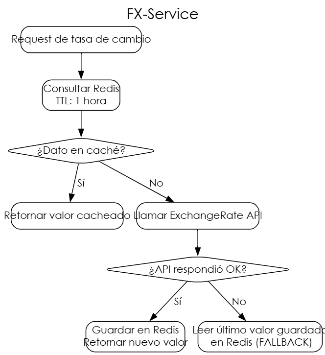

# Documentación Técnica — Práctica 5
---

# 1. Documentación para la Justificacion de Alamacenamiento

## ¿Qué se almacena y dónde?

| Acción | Base | ¿Porque se usa? (justificación) |
|------|-------|---------------|
| Órdenes e ítems | PostgreSQL (order-db) | Puede haber una orden con muchos pedidos o items, lo que requiere consistencia transaccional y soporte para JOINs. |
| Pagos | PostgreSQL (payment-db) | Separado de order-db porque el microservicio de pagos es independiente y puede escalar por separado según la carga financiera. |
| Usuarios | PostgreSQL (auth-db) | Datos relacionales con referencia |
| Restaurantes y menú | PostgreSQL (restaurant-db) | Misma justificación que auth-db: datos estructurados con relaciones. |
| Tasas de cambio | Redis | Caché en memoria ultra rápido y soporte de fallback ante fallos de la API externa. |
| Fotografías de entrega | Base64 en PostgreSQL (order-db) | Columna deliveryPhoto en la tabla de órdenes. |

---

## Decisión: Almacenamiento de Fotografías de Evidencia

### Estrategia elegida: Base64 en PostgreSQL

Las fotografías de evidencia de entrega se almacenan como texto en formato **Base64** directamente en la columna `deliveryPhoto` de la tabla `order` dentro de la base de datos `order-db`.

### ¿Por qué Base64 en base de datos y no otras alternativas?

Se evaluaron tres estrategias principales:

**Opción A — Base64 en base de datos (elegida)**

La imagen se convierte a una cadena de texto Base64 en el frontend o en el servicio, y se persiste como un campo de texto en la tabla `order`. La recuperación es inmediata junto con el resto de los datos de la orden, sin peticiones adicionales a sistemas externos.

*Ventajas:*
- Implementación simple: no requiere configurar servicios externos (S3, GCS, etc.)
- Transaccional: la foto queda atómica junto con el resto del registro de la orden
- Sin dependencias externas en tiempo de ejecución
- Apropiada para un contexto académico donde la simplicidad operacional prima sobre la optimización de almacenamiento

*Desventajas reconocidas:*
- Las cadenas Base64 aumentan el tamaño de la BD aproximadamente un 33% respecto al binario original
- No es óptima para imágenes de alta resolución en producción real
- Consultas a la tabla se vuelven más pesadas si se selecciona la columna foto siempre

**Opción B — File System local**

Guardar el archivo en una carpeta dentro del servidor del microservicio. Se descartó porque en un entorno Docker/contenedores el sistema de archivos no es persistente entre reinicios de contenedor, lo que provocaría pérdida de imágenes.

**Opción C — Cloud Bucket (AWS S3 / Google Cloud Storage)**

Almacenar la imagen en un servicio de almacenamiento de objetos en la nube y guardar únicamente la URL en la base de datos. Se descartó para esta práctica porque requiere configuración de credenciales de nube, se estan guardando los credidos para cuando se escale a la nube en el proyecto.

### Conclusión

Para el contexto académico de esta práctica, **Base64 en PostgreSQL** es la opción más adecuada porque garantiza simplicidad de implementación, atomicidad de los datos y cero dependencias externas adicionales. En un ambiente de producción real, la recomendación sería migrar al patrón de Cloud Bucket con URL almacenada en BD.

---

# 2. Documentación Técnica y Guía de Implementación — FX-Service

## Descripción General

El **FX-Service** (Foreign Exchange Service) es un microservicio NestJS responsable de proporcionar tasas de cambio de divisas en tiempo real al resto del sistema. Su función principal es convertir montos en Quetzales (GTQ) a otras monedas para que el usuario pueda visualizar el precio de su pedido en diferentes divisas.

## Arquitectura del Servicio


## Tecnologías Utilizadas

| Tecnología | Rol |
|------------|-----|
| NestJS | Framework del microservicio |
| Redis | Caché de tasas de cambio |
| ioredis / @nestjs/cache-manager | Cliente Redis en NestJS |
| ExchangeRate-API |Proveedor de tasas de cambio externas |
| Docker |Contenedorización del servicio y Redis |

## Configuración del Entorno

```env
# Variables de entorno del FX-Service
REDIS_HOST=redis
REDIS_PORT=6379
EXCHANGE_API_KEY=<tu_api_key>
EXCHANGE_API_URL=https://v6.exchangerate-api.com/v6
CACHE_TTL=3600   # TTL en segundos (1 hora)
```

## Implementación del Caché con Redis

### Lógica principal (fx.service.ts)

```typescript
async getExchangeRate(from: string, to: string): Promise<number> {
  const cacheKey = `fx:${from}:${to}`;

  // 1. Intentar leer de Redis
  const cached = await this.redisClient.get(cacheKey);
  if (cached) {
    return parseFloat(cached);
  }

  // 2. Si no está en caché, llamar a la API externa
  try {
    const response = await axios.get(
      `${process.env.EXCHANGE_API_URL}/${process.env.EXCHANGE_API_KEY}/pair/${from}/${to}`
    );
    const rate = response.data.conversion_rate;

    // 3. Guardar en Redis con TTL de 1 hora
    await this.redisClient.set(cacheKey, rate.toString(), 'EX', 3600);

    return rate;

  } catch (error) {
    // 4. FALLBACK: Si la API falla, usar el último valor en Redis
    const fallback = await this.redisClient.get(cacheKey);
    if (fallback) {
      console.warn('API externa falló, usando valor de caché como fallback');
      return parseFloat(fallback);
    }
    throw new Error('No hay tasa de cambio disponible');
  }
}
```

## Flujo Completo de Conversión

1. El frontend solicita al API Gateway la tasa de cambio GTQ → USD.
2. El Gateway delega al FX-Service.
3. El FX-Service consulta primero Redis con la clave `fx:GTQ:USD`.
4. Si Redis tiene un valor vigente (dentro del TTL), lo retorna inmediatamente.
5. Si Redis no tiene el valor o expiró, se realiza una petición HTTP a ExchangeRate-API.
6. La respuesta de la API se almacena en Redis con un TTL de 1 hora y se retorna al cliente.
7. Si la API externa falla (timeout, error 5xx), el servicio busca en Redis el último valor conocido y lo usa como fallback, garantizando disponibilidad del sistema incluso ante fallos externos.

## Endpoint Expuesto

```
GET /fx/rate?from=GTQ&to=USD
```

**Respuesta exitosa:**
```json
{
  "from": "GTQ",
  "to": "USD",
  "rate": 0.130138,
  "source": "cache"  // o "api"
}
```

## Estrategia de Fallback

El fallback con Redis es fundamental para la resiliencia del sistema. Dado que las tasas de cambio no varían drasticamente de un momento a otro, usar el último valor conocido (aunque sea de hace algunas horas) es preferible a fallar la transacción completa. Este patrón se conoce como **Stale-While-Revalidate** y es una práctica estándar en sistemas distribuidos.

---

# 3. Documentación Técnica — Flujo de Reembolso

## Descripción General

El flujo de reembolso cubre el proceso completo desde que una entrega falla hasta que el administrador aprueba la devolución del dinero al cliente y el sistema actualiza el estado del pago a `REEMBOLSADO`.

## Estados del Sistema Relevantes

```
Estado de Entrega:   EN_CAMINO → CANCELADO (entrega fallida)
Estado de Pago:      PAGADO → REEMBOLSADO (tras aprobación)
```

## Diagrama del Flujo

```
Repartidor marca entrega como CANCELADO
              │
              ▼
Delivery-Service actualiza estado de entrega a CANCELADO
              │
              ▼
Panel del Administrador muestra orden con estado:
  - Entrega: CANCELADO
  - Pago: PAGADO
  - Foto de evidencia visible
              │
              ▼
Administrador revisa la situación y presiona
"Aprobar Devolución de Dinero"
              │
              ▼
API Gateway recibe petición → Payment-Service
              │
              ▼
Payment-Service actualiza estado del pago a REEMBOLSADO
              │
              ▼
Sistema confirma al administrador que el reembolso fue procesado
```

## Implementación por Capas

### Delivery-Service — Marcar entrega como fallida

Cuando el repartidor no puede completar la entrega, actualiza el estado a `CANCELADO`:

```typescript
// delivery.service.ts
async updateDeliveryStatus(data: { delivery_id: string; status: string; reason: string }) {
  const delivery = await this.deliveryRepo.findOne({ where: { id: data.delivery_id } });
  delivery.status = data.status as DeliveryStatus;
  if (data.reason) delivery.reason = data.reason;
  await this.deliveryRepo.save(delivery);

  return { success: true, message: `Estado actualizado a ${data.status}` };
}
```

### Payment-Service — Procesar reembolso

```typescript
// payment.service.ts
async approveRefund(orderId: string): Promise<Payment> {
  const payment = await this.paymentRepo.findOne({ where: { orderId } });

  if (!payment) throw new Error('Pago no encontrado');
  if (payment.status !== 'PAGADO') {
    throw new Error('Solo se pueden reembolsar pagos en estado PAGADO');
  }

  payment.status = 'REEMBOLSADO';
  payment.refundedAt = new Date();
  return await this.paymentRepo.save(payment);
}
```

### API Gateway — Endpoint de aprobación

```typescript
// Ruta protegida, solo rol ADMINISTRADOR
POST /admin/payments/:orderId/refund
Authorization: Bearer <token_admin>
```

### Panel Administrativo (Frontend Angular)

El administrador visualiza las órdenes con entrega cancelada y tiene disponible el botón de reembolso:

```typescript
// admin.component.ts
approveRefund(orderId: string): void {
  this.paymentService.approveRefund(orderId).subscribe({
    next: () => {
      this.notifySuccess('Reembolso aprobado correctamente');
      this.loadOrders(); // recargar lista
    },
    error: (err) => this.notifyError(err.message)
  });
}
```

## Reglas de Negocio del Reembolso

| Regla | Descripción |
|-------|-------------|
| Solo el ADMINISTRADOR puede aprobar | El endpoint valida el JWT y el rol antes de procesar |
| Solo se reembolsan pagos en estado `PAGADO` | Si el pago ya fue reembolsado o no existe, el sistema retorna error |
| El reembolso es simulado | No se conecta a una pasarela real; se actualiza el estado en la BD |
| La foto de evidencia es consultable | El admin puede ver la foto del repartidor antes de decidir |
| Trazabilidad | Se registra la fecha del reembolso en el campo `refundedAt` |

## Flujo de Estados del Pago

```
PENDIENTE → PAGADO → REEMBOLSADO
                  ↘ (si entrega exitosa)
                    Sin cambio (pago finalizado)
```

## Consideraciones de Seguridad

- El endpoint `/admin/payments/:orderId/refund` está protegido con **JWT Guard** y **RolesGuard**, validando que el usuario autenticado tenga el rol `ADMINISTRADOR`.
- Un cliente o repartidor autenticado que intente acceder a este endpoint recibirá un error `403 Forbidden`.
- Solo se puede transicionar de `PAGADO` a `REEMBOLSADO`, no de otros estados, evitando reembolsos duplicados.

---

*Documentación generada para Práctica 5 — Software Avanzado*  
*Universidad de San Carlos de Guatemala — Ingeniería en Ciencias y Sistemas*