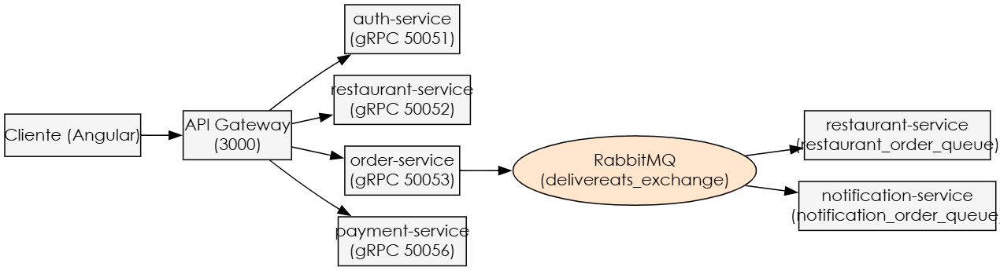
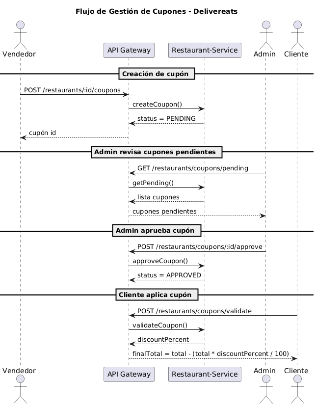
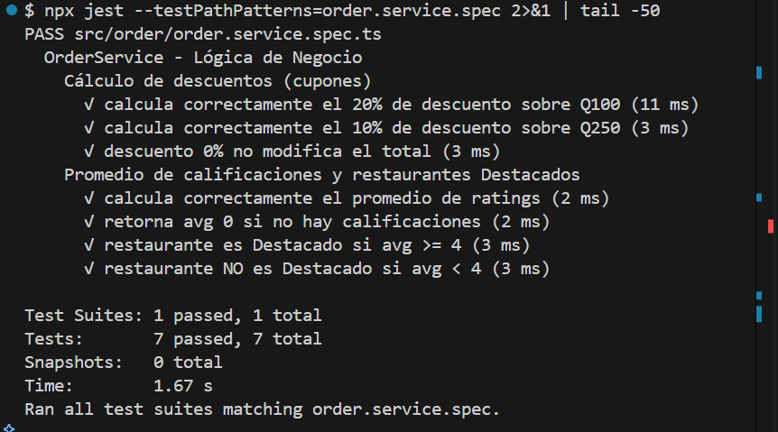
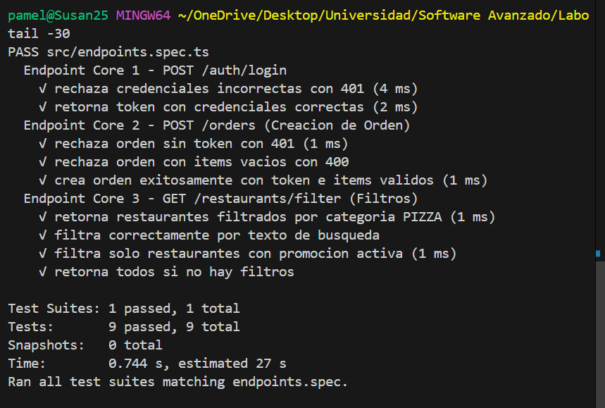

# DeliverEats — Práctica 6
**Universidad de San Carlos de Guatemala**  
**Facultad de Ingeniería — Escuela de Ciencias y Sistemas**  
**Curso: Software Avanzado**  
**Carné:** 201612218


## 1. Arquitectura de Microservicios




**Infraestructura Docker:**
- RabbitMQ: 5672/15672 (guest/guest)
- Redis: 6379
- PostgreSQL x4: 5433 (auth), 5434 (restaurant), 5435 (order), 5436 (payment)

---

## 2. Diagrama de Secuencia — Flujo Completo de Orden


---

## 3. Diagrama de Secuencia — Flujo de Cupones



---

## 4. Pruebas Unitarias

### 1 Lógica de Negocio 1 — Cálculo de Descuentos (Cupones)

**Archivo:** `order-service/src/order/order.service.spec.ts`

**Descripción:** Valida la fórmula matemática de aplicación de descuentos.


```
discountAmount = (orderTotal × discountPercent) / 100
finalTotal     = orderTotal - discountAmount
```

| Test | Entrada | Esperado | Resultado |
|------|---------|----------|-----------|
| 20% sobre Q100 | total=100, pct=20 | discount=20, final=80 |  PASS |
| 10% sobre Q250 | total=250, pct=10 | discount=25, final=225 |  PASS |
| 0% no modifica | total=150, pct=0 | final=150 |  PASS |

### 2 Lógica de Negocio 2 — Promedio de Calificaciones y Restaurantes Destacados

**Descripción:** Valida el cálculo de promedio de ratings y la determinación de restaurantes "Destacados" (avg ≥ 4).

| Test | Entrada | Esperado | Resultado |
|------|---------|----------|-----------|
| Promedio correcto | ratings=[5,4,3] | avg≈4.0 |  PASS |
| Sin calificaciones | ratings=[] | avg=0 |  PASS |
| Es Destacado | ratings=[5,4] | avg≥4 = true |  PASS |
| No es Destacado | ratings=[2,3] | avg≥4 = false |  PASS |

**Resultado total:** 7/7 tests pasando 

```
Test Suites: 1 passed, 1 total
Tests:       7 passed, 7 total
Time:        1.67s
```


# 5.  Endpoints Core

**Archivo:** `api-gateway/src/endpoints.spec.ts`

# Resultados de Pruebas - Endpoints API

## Estado General
- **Test Suites:** 1 passed / 1 total
- **Tests ejecutados:** 9 passed / 9 total
- **Snapshots:** 0
- **Tiempo de ejecución:** 0.744 s

---

## Endpoint Core 1 - POST /auth/login

Pruebas realizadas:

- Rechaza credenciales incorrectas con **401**
- Retorna **token** con credenciales correctas

---

## Endpoint Core 2 - POST /orders (Creación de Orden)

Pruebas realizadas:

- Rechaza orden sin **token** con **401**
- Rechaza orden con **items vacíos** con **400**
- Crea orden exitosamente con **token e items válidos**

---

## Endpoint Core 3 - GET /restaurants/filter (Filtros)

Pruebas realizadas:

- Retorna restaurantes filtrados por categoría PIZZA
- Filtra correctamente por texto de búsqueda
- Filtra solo restaurantes con promoción activa
- Retorna todos los restaurantes si no se aplican filtros

---

## Conclusión

Todos los endpoints evaluados funcionan correctamente según los criterios definidos.  
Las 9 pruebas automatizadas fueron superadas exitosamente, confirmando que:

- La autenticación funciona correctamente.
- La creación de órdenes valida seguridad y datos.
- El sistema de filtros de restaurantes responde adecuadamente.


---

## Instrucciones de Ejecución

```
# Ejecutar tests — lógicas de negocio
cd order-service && npx jest --testPathPatterns=order.service.spec

# Ejecutar tests — endpoints
cd api-gateway && npx jest --testPathPatterns=endpoints.spec
```

---

## 6. Endpoints Principales

### Auth
| Método | Ruta | Rol | Descripción |
|--------|------|-----|-------------|
| POST | /auth/login | Público | Login |
| POST | /auth/register | Público | Registro |

### Restaurantes
| Método | Ruta | Rol | Descripción |
|--------|------|-----|-------------|
| GET | /restaurants | Público | Listar restaurantes |
| GET | /restaurants/filter | Público | Filtrar restaurantes |
| GET | /restaurants/:id/promotions/active | Público | Promociones activas |
| POST | /restaurants/:id/coupons | Vendedor | Crear cupón |
| POST | /restaurants/coupons/validate | Cliente | Validar cupón |
| POST | /restaurants/coupons/:id/approve | Admin | Aprobar cupón |

### Órdenes
| Método | Ruta | Rol | Descripción |
|--------|------|-----|-------------|
| POST | /orders | Cliente | Crear orden |
| GET | /orders/my | Cliente | Mis órdenes |
| PATCH | /orders/:id/status | Repartidor | Actualizar estado |
| POST | /orders/:id/delivery-photo | Repartidor | Confirmar entrega |
| POST | /orders/rate | Cliente | Calificar orden |
| GET | /orders/by-status/:status | Repartidor | Órdenes por estado |
| GET | /admin/orders/finished | Admin | Órdenes finalizadas |
| POST | /admin/orders/:id/refund | Admin | Aprobar reembolso |